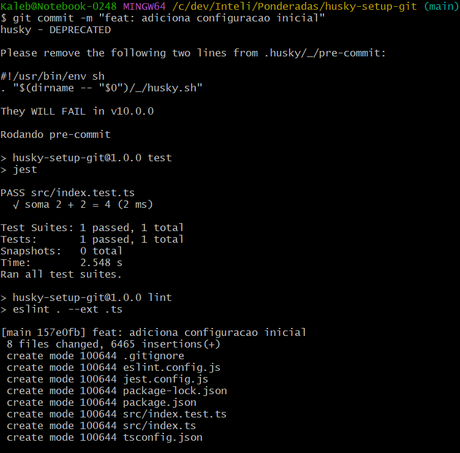
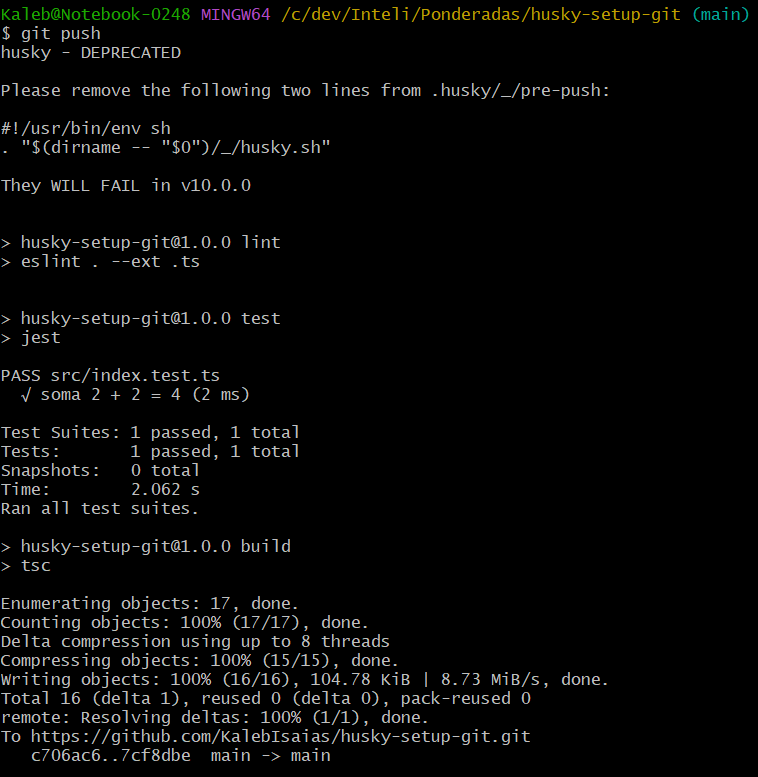

# Relatório - Configuração do Husky

## Objetivo
Configurar hooks de pré-commit e pré-push usando Husky para garantir qualidade e segurança do código.

## Etapas

1. Criação do repositório GitHub: `husky-config-demo`
2. Instalação das dependências: `husky`, `typescript`, `eslint`, `jest`
3. Configuração dos scripts de build, test e lint no `package.json`
4. Criação dos hooks:
   - **pre-commit**: executa `npm run build && npm run lint`
   - **pre-push**: executa `npm run test`
5. Implementação de uma função simples (`soma`) e teste correspondente
6. Execução e verificação dos hooks com prints

## Prints

### Pre-commit executando:

### Pre-push executando:

## Conclusão
Com o Husky, conseguimos impedir o commit de código quebrado e garantir que todo código testado e lintado esteja em conformidade antes de ser integrado ao repositório principal.
